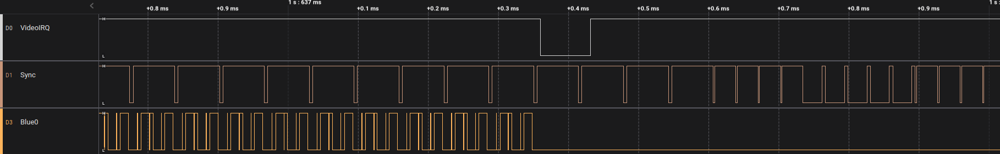
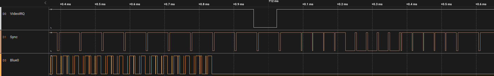
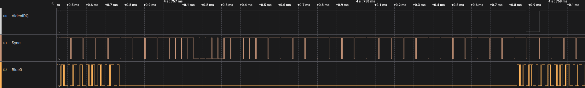
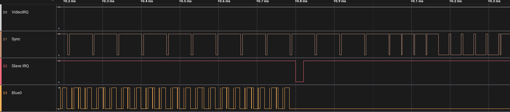
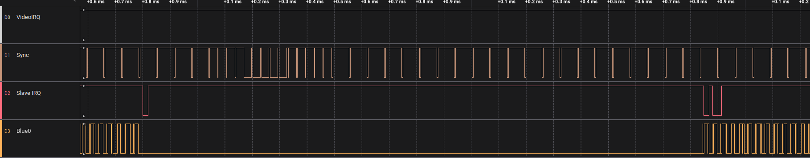

# MCD212

Observations concerning VideoIRQ, ICA and DCA timing

Questions to answer:
1. When the is ICA executed
2. When the is DCA executed
3. The state of Display Active relative to video timing

## When generating the INT very early on in the ICA

It occurs before VSync, just after VBlank since output of pixel data stops before it



## When generating the INT a little bit later at the ICA instruction 166

The shift caused by the execution time is noticeable.



## When generating the INT at the first instruction of the DCA

The IRQ occurs exactly at the end of the first line. That also fits the datasheet, but not the green book. I assume that the driver takes care of this discrepancy.



## Timing of Display Active bit

Register CSR1R[7] is a rather undocumented indicator for display timing
To analyze it, this program is used.

```c

	for (;;)
	{
		unsigned char status = *((unsigned char *)0x4ffff1);

		if (last_status != status)
		{
			SLAVE_CH2 = 0x83;
			if (status & 0x80)
			{
				SLAVE_CH2 = 0x83;
			}
			last_status = status;
		}
	}
```
The Slave IRQ will occur once on falling edge and twice on rising edge.



This shows that Display Active is 0 as soon as output of pixel data stops.
This would also mean that the ICA starts at exactly the same time.



This shows that Display Active is 1 as soon as output of pixel data starts.
This also means that it is 1 before the first DCA is executed.

