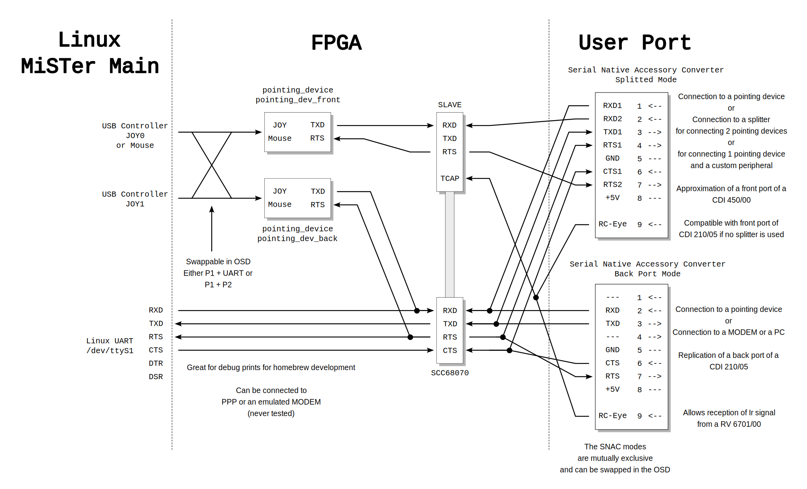

# SNAC (Serial Native Accessory Converter)

The User port of the MiSTer offers 7 data lines to use for the core.
The serial port of the CD-i - at the front or back - makes use of 8 pins.
6 of those are data lines. Together with one line for the infrared signal
for the remote controller, this seems to be a match.

Since every CD-i has different types of ports, we rely on the common denominator.
Two SNAC modes are offered.

The **RS232 Mode** simulates a back port of a 210/05. It is connected to the UART of the SCC68070.

The **Dual Input Mode** simulates the front port of a CD-i that supports the official input port splitter.

* Without a splitter, it can take one pointing device which is connected to the SLAVE.
* With the splitter, the second device is connected to the SCC68070

|     | Dual Input Mode                            | Back Port Mode                   | Direction |
| --- | ------------------------------------------ | -------------------------------- | --------- |
| 1   | RXD1                                       | \-\-\-                           | In        |
| 2   | RXD2                                       | RXD                              | In        |
| 3   | TXD1                                       | TXD                              | Out       |
| 4   | RTS1                                       | \-\-\-                           | Out       |
| 5   | GND                                        | GND                              | \-\-\-    |
| 6   | CTS1                                       | CTS                              | In        |
| 7   | RTS2                                       | RTS                              | Out       |
| 8   | +5V                                        | +5V                              | \-\-\-    |
| 9   | RC-Eye                                     | RC-Eye                           | In        |
|     | Can take 2 controllers using a splitter | Fully compatible to back Port |           |

The splitter is an official Philips CD-i accessory for single port CD-i players.
But you can [build one yourself](https://www.theworldofcdi.com/make-your-own-cd-i-port-splitter-for-2-player-games/)

##  User Port Pinout

Please find more info [here](https://mister-devel.github.io/MkDocs_MiSTer/developer/emu/#serial-support) from the official MiSTer documentation.

This table is also meant to be useful as a soldering instruction

| USB 3.0 Pin# | USB 3.0 Signal      | MiSTer User Port | FPGA I/O       | CD-i Port            |
| ------------ | ------------------- | ---------------- | -------------- | -------------------  |
| 1            | VBUS                | +5V              | Power          | 8 +5V                |
| 2            | D−                  | TX / SDA         | USER_IO[1]     | 1 \-\-\- (Split RXD) |
| 3            | D+                  | RX / SCL         | USER_IO[0]     | 2 RXD                |
| 4            | GND                 | GND              | Ground         | 5 GND                |
| 5            | StdA_SSRX−          | IO10             | USER_IO[5]     | 3 TXD                |
| 6            | StdA_SSRX+          | IO11             | USER_IO[4]     | 7 RTS                |
| 7            | GND_DRAIN           | IO12             | USER_IO[3]     | 4 DTR (Split RTS)    |
| 8            | StdA_SSTX−          | IO13             | USER_IO[2]     | 6 CTS                |
| 9            | StdA_SSTX+          | IO8              | USER_IO[6]     | RC-Eye               | 
| Shield       | Connector Shield    | Shield           | Chassis Ground |                      |

## Voltage Levels

The RV 8701 Spoon controller might be problematic. The TX signal seems to have no drive to low level
and fully relies on the internal pull down, one could find in a CDI 210/05.
It only drives 4V during High level, when having a pull down of 960 ohm attached to it.
Maybe it is a rather weak output driver.

This is bad, because the SNAC level shifter seems to use an open drain approach
that is also similar to what I2C uses for level shifting.

The peace keeper doesn't have that issue and drives in both directions.
It offers 1V low level and 4.8V high level when used against a standard SNAC USB mini level shifter.

I conclude, that the RV 8701 is not compatible with a passive connection to the SNAC level shifter.

## Architecture

